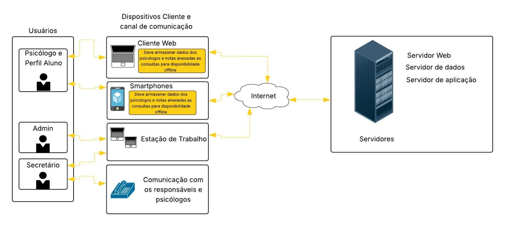

<h1>Visão do Produto</h1>

<h2>Sistema Shalom+</h2>

<small>Versão 1.0</small>

---

## Histórico de revisões

|    Data    | Versão |           Descrição           |      Autores       |
| :--------: | :----: | :---------------------------: | :--------------: |
| 26/05/2025 |  1.0   |     Criação do documento      | Laila de Aquino, Letícia Lopes, Luan Pimenta e Suetone Carneiro |

---

## Sumário

- [Introdução](#introdução)
  - [Propósito](#propósito)
  - [Definições e abreviações](#definições-e-abreviações)
    - [Abreviações](#abreviações)
    - [Definições](#definições)
  - [Escopo do produto](#escopo-do-produto)
- [Posicionamento](#posicionamento)
  - [Oportunidade de negócios](#oportunidade-de-negócios)
  - [Descrição dos benefícios para os clientes e dos problemas resolvidos](#descrição-dos-benefícios-para-os-clientes-e-dos-problemas-resolvidos)
- [Descrição dos stakeholders e dos usuários](#descrição-dos-stakeholders-e-dos-usuários)
  - [Stakeholders](#stakeholders)
  - [Usuários e atores](#usuários-e-atores)
- [Descrição do ambiente de uso](#descrição-do-ambiente-de-uso)
  - [Ambiente de uso](#ambiente-de-uso)
  - [Necessidades principais quanto ao ambiente](#necessidades-principais-quanto-ao-ambiente)
- [Visão geral do produto](#visão-geral-do-produto)
  - [Visão geral](#visão-geral)
  - [Custo e venda](#custo-e-venda)
  - [Licenciamento e instalação](#licenciamento-e-instalação)
  - [Características e funcionalidades de alto nível](#características-e-funcionalidades-de-alto-nível)
  - [Restrições](#restrições)

# Introdução

O Documento de Visão do Produto (DVP) é um documento que descreve o produto de software que será desenvolvido. Ele descreve o problema que será resolvido, as principais necessidades dos stakeholders, as principais funcionalidades do sistema, as restrições do projeto, etc.

## Propósito

O objetivo deste documento é coletar, analisar e definir características e as necessidades de alto nível do **Sistema Shalom+.**

Ele se concentra nos recursos necessários aos stakeholders e aos usuários, e nas razões que levam a essas necessidades.

Os detalhes de como o **Sistema Shalom+** atingem essas necessidades são descritos nas _especificações de casos de uso_ e nos _requisitos funcionais_.

## Definições e abreviações

### Abreviações

| Termo | Definição                                    |
| :---: | -------------------------------------------- |
|  DVP  | Documento de Visão do Produto                |
|  CRP  | Conselho Regional de Psicologia      |
|  CRM  | Conselho Regional de Medicina      |
|  SRS  | Especificação de Requisitos de Software      |
|  UML  | Linguagem de Modelagem Unificada             |
|  SaaS  | Software as a Service             |

### Definições

|    Termo    | Definição                                                                                                                       |
| :---------: | ------------------------------------------------------------------------------------------------------------------------------- |
|   Cliente   | É uma pessoa física ou jurídica que compra um produto ou contrata um serviço.                                                   |
| Usuário  | É uma pessoa física que interage com o sistema.                                                               |
|   Aluno   |   É uma pessoa física, menor de idade, que frequenta a escola   |
|   Responsável   |   É uma pessoa física, maior de idade, legalmente reconhecido como responsável por um aluno  |
|   Psicólogo   |   É um profissional da saúde com CRP ativo que atua na escola   |
|   Secretário   |    É um profissional que atua na escola em afazeres administrativos  |
| Aliança terapêutica | É a relação de colaboração, confiança e vínculo estabelecida entre o psicólogo e o paciente, essencial para a efetividade do processo terapêutico. |
| Laudo psicológico | É o documento técnico elaborado por um psicólogo, que apresenta a avaliação, diagnóstico e conclusões sobre o estado psicológico de um indivíduo. |
| Software as a Service | É um modelo de distribuição de software em que o sistema é acessado pela internet, sem necessidade de instalação local, sendo pago geralmente por assinatura. |

## Escopo do produto

O **Sistema Shalom+** é um sistema que tem como objetivo facilitar o gerenciamento de consultas com psicólogos na escola social Shalom, proporcionando o armazenamento de informações e prontuários, bem como a realização do agendamento dessas consultas. Será utilizado por alunos (e responsáveis), secretários e psicólgos que fazem parte da escola e necessitam interagir com serviços de atendimento psicológico e serem informados em caso de alterações nas consultas agendadas.

---

# Posicionamento

## Oportunidade de negócios

O **Sistema Shalom+** apresenta várias oportunidades de negócios, tais como:

1. **Expansão para outras instituições educacionais**: após a implementação bem sucedida na Escola Social Shalom, o sistema pode ser fornecido a outras escolas, institutos ou redes de ensino que oferecem suporte psicológico.
2. **Ampliação para outros projetos Sociais**: o sistema pode ser utilizado em outros programas sociais que necessitem de algum tipo de agendamento, como clínicas comunitárias.
3. **Geração de receita via licenciamento SaaS**: transformar o Shalom+ em uma plataforma SaaS (Software as a Service), com planos mensais ou anuais.
4. **Ampliação para clínicas e consultórios particulares**: adaptação do Shalom+ para uso por psicólogos autônomos ou clínicas, com agendamento online, lembretes automáticos e prontuários eletrônicos.
5. **Oferecimento de espaço para marcas apoiadoras**: a Shalom é uma escola social e precisa de apoio de pessoas e empresas. É possível implantar no sistema um espaço onde apareçam as empresas e pessoas apoiadoras.

## Descrição dos benefícios para os clientes e dos problemas resolvidos

| Benefícios                    | Problemas Resolvidos                                                    | Afetados                                   |
| ----------------------------- | ----------------------------------------------------------------------- | ------------------------------------------ |
| Agendamento online simples e acessível   | Dificuldade para marcar consultas com psicólogos                | Alunos e responsáveis |
| Prontuário eletrônico com registro contínuo       | Falta de acompanhamento estruturado do histórico de atendimentos                    | Alunos, responsáveis e psicólogos |
| Armazenamento seguro e controle de acesso às informações | Exposição de informações sensíveis e falta de privacidade                           | Alunos, responsáveis e psicólogos |
| Agenda automatizada e controle de disponibilidade    | Agendas sobrecarregadas ou desorganizadas | Psicólogos e secretários  |
| Redução da carga de trabalho com agendamentos e registros manuais          |    Sobrecarga de tarefas administrativas repetitivas    | Psicólogos e secretários |
| Notificações sobre alterações nas consultas agendadas | Desagendamento de consultas sem possibilidade de comunicação rápida | Alunos, responsáveis, psicólogos e secretários |

---

# Descrição dos stakeholders e dos usuários

Esta seção descreve os stakeholders e os usuários do **Sistema Shalom+.**

## Stakeholders

Segue abaixo a lista de stakeholders.

| Stakeholder                            | Descrição                                                                                                                                               | Papel                                                           |
| -------------------------------------- | ------------------------------------------------------------------------------------------------------------------------------------------------------- | --------------------------------------------------------------- |
| Médicos empresários                               | Profissionais da área da saúde mental que apoiam financeiramente                                            | Financiadores do sistema                                              |
| Diretores da Casa Shalom              | Responsáveis pela administração geral da escola social                                                                                          | Representantes institucionais                                                 |
| Desenvolvedores	                     | Responsáveis pela construção, manutenção e melhoria do sistema                         | Desenvolvimento e manutenção do sistema                                              |
| Psicólogos                 | Profissionais responsáveis por realizar os atendimentos                                    | Usuários e avaliadores éticos do sistema              |
| Responsáveis dos alunos | Pais que acessam o sistema para agendar as consultas                                             | Usuários do sistema           |
| Secretários | Funcionários responsáveis pela gestão de informações sobre os agendamentos                                             | Usuários do sistema           |
| Administradores do sistema              | Responsáveis por corrigir falhas, gerenciar contas e garantir o bom funcionamento da aplicação. | Gestão técnica e suporte

## Usuários e atores

Segue tabela com os usuários e atores do sistema:

| Usuário                  | Descrição                                                                                                    | Responsabilidades                                                                                                                                                                                                                | Stakeholders                                                                                    |
| ------------------------ | ------------------------------------------------------------------------------------------------------------ | -------------------------------------------------------------------------------------------------------------------------------------------------------------------------------------------------------------------------------- | ----------------------------------------------------------------------------------------------- |
| Psicólogos                 | Profissionais responsáveis pelos atendimentos psicológicos infantis | Realizar e registrar atendimentos, acessar prontuários, consultar agendamentos, gerenciar rotina de consultas                                                                           | Médicos empresários, diretores, equipe de desenvolvimento           |
| Responsáveis dos alunos     | Usuários com acesso ao perfil dos alunos.            | Agendar consultas, visualizar status e informações básicas, receber notificações  | Diretores, psicólogos e secretários |
| Secretários	 | Gestão dos agendamentos                                                   | Conferir sessões agendadas e realizar reagendamentos                                                                                                       | Psicólogos, Diretores, Responsáveis                          |
| Admin do sistema	 | Gestão interna da aplicação                                                   | Gerenciamento de usuários, verificação de funcionamento, atualização de dados e revisão de falhas e correções.                                                                                                       | Equipe de desenvolvimento, diretores                          |

---

# Descrição do ambiente de uso

## Ambiente de uso

A seguir, são descritos alguns ambientes em que o sistema pode ser utilizado:

1. **Ambiente do Aluno (usado pelos responsáveis):**
Este ambiente é acessado por pais para agendar ou cancelar consultas psicológicas, além de acompanhar o histórico de atendimentos. O acesso pode ser feito por smartphone Android ou iOS, com uma interface extremamente simples, com ícones e visual adaptado para pessoas que não sabem ler e escrever.

2. **Ambiente do Psicólogo:**
Utilizado por profissionais de psicologia. Aqui, os psicólogos podem visualizar e organizar seus horários de atendimento, receber notificações de novos agendamentos, preencher prontuários e acompanhar o histórico de cada paciente. O sistema poderá ser acessado por computadores e smartphones, com foco em recursos de segurança e confidencialidade para dados mais sensíveis dos pacientes.

3. **Ambiente do Secretário:** 
Voltado para os secretários da escola, que conferem os agendamentos e fazem a gestão necessária, realizando, se necessário, reagendamentos via ligação. O sistema será utilizado principalmente via computador com navegador web, em ambiente local da escola.

4. **Ambiente do Admin:**
Responsável pela gestão geral do sistema. Acesso via computador, com permissões elevadas para atualização de cadastros, configuração de funcionalidades e manutenção da aplicação.

## Necessidades principais quanto ao ambiente

A seguir, é apresentada uma tabela que descreve as necessidades dos clientes com relação à qualidade, desempenho, escalabilidade, segurança, usabilidade e disponibilidade do sistema Shalom+, juntamente com sua prioridade, interesse, solução atual e soluções propostas:

| Necessidade                                                                                                                                              | Prioridade | Interesse                                                                                                                                                | Solução Atual                                                                                                                 | Soluções Propostas                                                                                                                                                                                                                                                       |
| -------------------------------------------------------------------------------------------------------------------------------------------------------- | ---------- | -------------------------------------------------------------------------------------------------------------------------------------------------------- | ----------------------------------------------------------------------------------------------------------------------------- | ------------------------------------------------------------------------------------------------------------------------------------------------------------------------------------------------------------------------------------------------------------------------ |
| **Qualidade:** O sistema deve ser estável e ter informações confiáveis                                                                             | Alta       | Os usuários precisam confiar no sistema para realizar agendamentos consistentes                                                                     | Agendamento e registros feitos manualmente                                          | Realizar atualizações periódicas nos dados                                                                                                          |
| **Desempenho:** A aplicação deve ser leve e rápida                                         | Alta       | Responsáveis precisam agendar rapidamente, sem travamentos ou lentidão.                                                     | O agendamento manual acaba sendo problemático por depender de pessoas                                         | Otimização de desempenho com foco em carregamento rápido e uso offline parcial.                                                                                                          |
| **Escalabilidade:** O sistema deve ter capacidade para suportar o crescimento do número de usuários e consultas em dias de pico de agendamento.                                         | Alta       | Os clientes esperam que o sistema continue funcionando em dias de agendamento. | Não há gerenciamento para casos grande demanda de agendamentos                                                | Implementar arquitetura para garantir a escalabilidade do sistema.                                                                                                                                                                     |
| **Segurança:** Prontuários e relatórios psicológicos devem ser protegidos contra acessos indevidos.                                             | Alta       | Preservar o sigilo profissional e a ética na psicologia                                           | Registros são feitos manualmente em papel, não possuindo barreiras de segurança  | Autenticação com dois fatores para psicólogos, principalmente em áreas com laudos e dados sensíveis e controle de acesso de perfil.                                                                                                                                                                                                                                                     |
| **Usabilidade:** O sistema deve ser fácil de usar e entender, com uma interface intuitiva e amigável ao usuário, principalmente os que não sabem ler e escrever.                                         | Alta   | Parte dos responsáveis podem não saber ler.                                         | Agendamentos são feitos presencialmente sem necessitar de leitura e escrita                                                                                    | Uso de ícones, assistentes de acessibilidade.                                                                                                                                    |
| **Disponibilidade:** O sistema deve estar disponível em qualquer horário. | Alta   | O sistema deve permitir a conferência de informações a qualquer horário, assim como o acesso de informações relacionadas ao paciente pelo perfil do psicólogo.            | Informações são obtidas apenas presencialmente ou via ligação em horário comerical                                                                     | Sistema web e mobile, disponível 24/7, com servidores em nuvem.

---

# Visão geral do produto

## Visão geral

O sistema Shalom+ é um sistema de agendamento de consultas psicológicas, desenvolvido para atender às necessidades da escola social Shalom+. O objetivo é facilitar o acesso dos usuários aos serviços oferecidos. Dessa maneira, o sistema permite que os clientes agendem consultas, consultem informações dos psicólogos disponíveis e entrem em contato com os profissionais de forma simples e eficiente.

Como o Shalom+ é um software, ele não exige hardware específico para sua operação nos dispositivos dos usuários, apenas um smarthphone ou computador com acesso à internet. Essa caracteristica garante que os clientes possam utilizar o sistema de qualquer lugar e a qualquer momento. Além disso, informações essenciais, como os dados dos psicólogos, estarão disponíveis mesmo sem conexão à internet. A infraestrutura necessária será implementada a partir dos serviços de nuvem para hospedar a aplicação e armazenar informações. 

A comunicação entre os dispositivos e o sistema ocorre por meio de conexões de rede, normalmente utilizando o protocolo HTTP. As requisições feitas pelos usuários são processadas pelo servidor, que responde com as informações correspondentes, viabilizando a interação com o sistema de forma dinâmica.

**Figura 1** - Arquitetura ambiental do sistema Shalom+

## Custo e venda

A análise de custo do sistema Shalom+ está voltada principalmente para os médicos empresários, que são os clientes e apoiadores financeiros da escola social.

## Licenciamento e instalação

O produto Shalom+ será disponibilizado por meio de uma licença de uso, que será fornecida pela empresa desenvolvedora do software. A licença permitirá ao cliente utilizar o software, que estará hospedado em nuvem pública, desde que atenda aos requisitos de infraestrutura previstos no documento de instalação do produto.

O acesso ao sistema será realizado por meio da internet, garantindo que os usuários possam utilizar o Shalom+ com segurança e eficiência, a partir de navegadores web ou aplicativos móveis.

A instalação e a configuração do ambiente serão realizadas pela equipe técnica da empresa desenvolvedora, garantindo que o sistema esteja disponível adequadamente para os clientes.

Após a configuração, o cliente receberá um login e senha para acessar o sistema e começar a utilizar todas as funcionalidades previstas.

## Características e funcionalidades de alto nível

Esta seção define e descreve as características do Shalom+. Trata-se dos requisitos de alto nível do sistema, necessários para propiciar benefícios aos usuários.

1. O sistema deve permitir o cadastro de usuários e atendimentos, incluindo informações importantes como o perfil do usuário e o histórico dos atendimentos realizados.
2. O sistema deve possibilitar a visualização de horários disponíveis para agendamento de consultas, bem como a solicitação e o cancelamento de atendimentos.
3. O sistema deve permitir o registro de atendimentos psicológicos, com a inserção de notas privadas pelos psicólogos e a manutenção de um histórico por aluno.
4. O sistema deve enviar notificações de alerta aos usuários, como lembretes de agendamentos e avisos de cancelamentos.
5. O sistema deve garantir a segurança das informações, com acesso restrito e controle de permissões conforme o perfil de cada usuário.
6. O sistema deve oferecer uma interface amigável, permitindo que as funcionalidades sejam utilizadas de forma simples e intuitiva para atender ao público.
7. O sistema deve apresentar desempenho satisfatório, com tempos de resposta rápidos e sem interrupções.
8. O sistema deve ser escalável, adaptando-se ao aumento de usuários e funcionalidades sem prejudicar a qualidade.
9. O sistema deve ser desenvolvido em conformidade com as normas e padrões de qualidade estabelecidos para o desenvolvimento de software.
10. O sistema deve ser documentado, com código-fonte disponível para auditoria e manutenção futura.

## Restrições

1. **Restrições de orçamento:** O projeto não deve exceder o orçamento previamente combinado com os clientes.

2. **Restrição de tempo:** O sistema deve ser desenvolvido e implementado dentro de um prazo específico e não pode ser estendido, conforme negociado com o cliente.
 
3. **Restrição de hardware:** O sistema deve funcionar em hardwares modernos e comuns, sem a necessidade de requisitos técnicos específicos.
 
4. **Restrição de segurança:** Todos os dados dos usuários devem ser tratados conforme a Lei Geral de Proteção de Dados (LGPD). Além disso, determinadas informações sensíveis dos alunos, a exemplo do laudo, devem ser acessíveis apenas a psicólogos com permissões específicas.
 
5. **Restrição de usabilidade:** O sistema deve ser intuitivo, acessível e adaptado a usuários que não sabem ler, ou tenham alguma dificuldade. Para isso, serão utilizados ícones claros, coloridos e de fácil associação. Além disso, o sistema também deve evitar o deslogamento automático, a fim de evitar redefinições de acesso.
 
6. **Restrição de interoperabilidade:** O sistema deve ser compatível com outros softwares e plataformas.
 
7. **Restrições de desempenho:** O sistema precisa garantir bom desempenho, dessa forma, deve apresentar boa velocidade de resposta e capacidade de escalabilidade para suportar o aumento de usuários.

8. **Restrições geográficas:** O sistema será utilizado exclusivamente para atendimentos presenciais realizados na sede da escola social Shalom+. Portanto, não há necessidade de suporte a múltiplos fusos horários ou idiomas estrangeiros. O sistema deve funcionar em território nacional, no idioma português.

---

Data: 26 de maio de 2025

---
Criado em Março de 2025 por _Letícia Lopes, Laila de Aquino, Luan Pimenta e Suetone Carneiro_